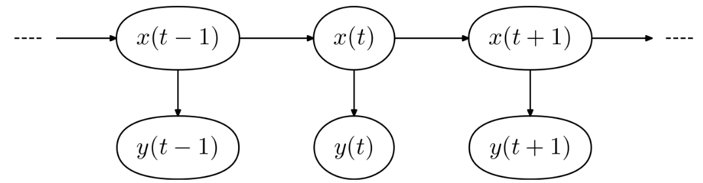
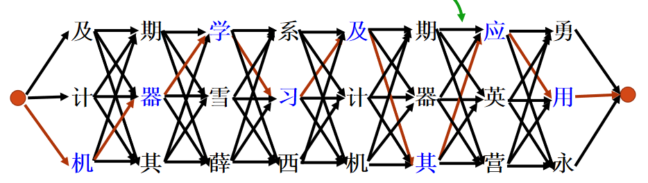

# 拼音输入法

李昊 2021010661

# 一、二元算法

## 1.基本思路与公式推导

### a.隐马尔可夫模型HMM

它用来描述一个含有隐含未知参数的马尔可夫过程。其难点是从可观察的参数中确定该过程的隐含参数。（Wikipedia）

隐藏变量为x，可观察状态为y，每个t时刻的y值仅与x相关，而t时刻的x值与t时刻之前的x值有关。

如下图所示



要处理的拼音输入法问题正是HMM的典型问题之一：**解码问题**——已知模型参数，寻找最可能的能产生某一特定输出序列的隐含状态的序列，通常使用**维特比算法**解决。

### b.viterbi算法

考虑字的二元模型。也即认为每一时刻的隐藏状态$x(t)$仅与$x(t-1)$有关，则问题核心即为最大化这样一个概率

$$
P(w_1w_2...w_n)=P(w_1出现的概率)P(w_2|w_1)...P(w_{n}|w_{n-1})
$$

其中$w_i$代表拼音序列中第i个拼音对应的满足要求的汉字，考虑到概率本身可能很小，为了解决它们的乘积下溢的问题，采用**最小化**以下的指标的方法：

$$
-log(P(w_1w_2...w_n))=-log(P(w_1出现的概率))-log(P(w_2|w_1))-...-log(P(w_{n}|w_{n-1}))
$$

对应的维特比算法，在下图中



只需求出最短路径（此处的路径即为上面的负对数指标），对某一层（第i层，n个元素），由于全局最优一定有局部最优，因此只需考虑前一层（m个元素）已经计算出来的最佳路径——对n个元素中的每一个，计算它与前一层m个元素中的每一个的距离（w）加上前一层已经算出来的局部最优的距离，将其中的最小值赋给当前层的元素，然后在当前层的元素中存下路径——这样从第二层开始的每一层只需计算对应的m*n次，最终复杂度加起来会比蛮力遍历所有路径优得多。

## 2.具体实现

`pinyin.py`

以下讲述处理一个拼音序列的方法

1. 对这个序列中的每一项，查询拼音——汉字字典，每一项拼音可以得到一个列表，整个序列组织成一个list，第i项是第i个拼音对应的可选的汉字的列表。对应`read_pinyin`函数
2. 实现viterbi算法，维护两个list：last_layer以及now_layer，二者的元素都是tuple，具体是(从起点开始的路径也即字符串，路径长度也即指标)，第一层的指标为$-log(字频/总字数)$，之后每一层为 `上一层的最优路径长度+$(-log(AB的次数/A的次数))$` 的最小值。

最终输出最短路径即可

注：

- 阈值选用10
- 平滑处理——当某个频率为0时，赋一个较小的值作为频率。具体为1e-20。
- 总字数TOT_CHAR取为1e10

# 二、实验环境

```cpp
Ubuntu 20.04.3
Linux version 5.10.16.3-microsoft-standard-WSL2 (oe-user@oe-host) (x86_64-msft-linux-gcc (GCC) 9.3.0, GNU ld (GNU Binutils) 2.34.0.20200220) #1 SMP Fri Apr 2 22:23:49 UTC 2021
```

可以参考`requirements.txt`

## 文件目录

```cpp
pinyin_input_method
├─ .gitignore
├─ data
│  ├─ input.txt
│  ├─ output.txt
│  ├─ std_output.txt
│  ├─ trigram_output.txt
│  ├─ trigram_wiki_output.txt
│  └─ wiki_output.txt
├─ requirements.txt
└─ src
   ├─ data
   │  ├─ frequency_table.txt
   │  ├─ pinyin_table.txt
   │  ├─ trigram_frequency_table.txt
   │  ├─ trigram_wiki_frequency_table.txt
   │  └─ wiki_frequency_table.txt
   ├─ metric
   │  └─ accuracy.py
   ├─ pic
   │  ├─ HMM.png
   │  └─ viterbi.png
   ├─ pinyin.py
   └─ pre_process
      ├─ frequency_table.py
      └─ pinyin_table.py
```

- data目录下存储的`std_output.txt`为用于比对的标准答案，`output.txt`与`trigram_output.txt`为sina语料对应的输出，含wiki的对应Wiki语料
- src/data下存放中间结果文件——拼音汉字表、频率表（不含wiki的为sina对应的频率表；不含trigram的存储字和两个字的出现次数，含trigram的存储三个字的出现次数）
- metric用以评价字准确率、句准确率
- pre_process生成中间结果文件
- pinyin.py实现输入法

```cpp
# 一个示例(如果要训练的话)——不能直接运行因为没有语料库，但是中间文件都已附上
python3 src/pre_process/pinyin_table.py
python3 src/pre_process/frequency_table.py --corpus_name SINA --save_path src/data/frequency_table.txt
python3 src/pinyin --input_path data/input.txt --output_path data/output.txt
python3 src/metric/accuracy.py --output_path data/output.txt --std_output_path data/std_output.txt

后面三个文件都有对应的命令行参数可供选择，可用-h查看
```

# 三、语料库与数据预处理

- 【必做】新浪新闻2016年的新闻语料库
- 【选做】在GitHub项目nlp_chinese_corpus中选择一个语料库：[https://github.com/brightmart/nlp_chinese_corpus](https://github.com/brightmart/nlp_chinese_corpus)具体来说为**维基百科json版(wiki2019zh)**

## 1.建立拼音汉字表

`src/pre_process/pinyin_table.py`

遍历拼音汉字表，将其组织为一个字典，key为拼音字符串，value为汉字的list，利用json存储字典

存储为`src/data/pinyin_table.txt`

## 2.建立频率表

`src/pre_process/frequency_table.py`

处理语料：

- 二元模型：遍历统计，对每个字统计出现的次数，对相邻（中间只要隔了不是汉字的字符就不算相邻）的两个字统计出现的次数。存储时，所有字都存贮，但是对于**两个字的串**，只存储出现次数大于阈值的。存储为`src/data/frequency_table.txt`或者`src/data/wiki_frequency_table.txt`
- 三元模型：只统计三个字连着出现的次数，大于阈值的存储`src/data/trigram_frequency_table.txt`以及`src/data/trigram_wiki_frequency_table.txt`

# 四、实验效果

- 采用sina新闻语料训练的二元模型——字准确率83.21%，句准确率38.12%
- 采用Wiki语料训练的二元模型——字准确率76.96%，句准确率25.35%

# 五、实例分析

正确实例

1. jing ji jian she he wen hua jian she tu chu le shi ba da jing shen de zhong yao xing 经济建设和文化建设突出了十八大精神的重要性
2. ren gong zhi neng cheng wei zai xian jiao yu ling yu de re ci 人工智能成为在线教育领域的热词
3. zhong guo gong chan dang yuan de chu xin he shi ming shi wei zhong guo ren min mou xing fu wei zhong hua min zu mou fu xing 中国共产党员的初心和使命是为中国人民谋幸福为中华民族谋复兴
4. yin wei hu lian wang gai bian le chuan tong chu ban ye de ying xiao mo shi 因为互联网改变了传统出版业的营销模式
5. zhu bo ni wei shen me bu shuo hua le 主播你为什么不说话了

错误实例

1. 大**的**上的一切都**备**勤劳的双手修饰**的**那么和谐——大地上的一切都被勤劳的双手修饰得那么和谐
2. 我国在外交中一**项议**和平共处五项原则为基本准则——我国在外交中一向以和平共处五项原则为基本准则
3. **还效果**后**硬化**还是开了——海啸过后樱花还是开了
4. 我能**单的气**多大赞美就能**竞得起**多大**的回**——我能担得起多大赞美就能经得起多大诋毁
5. 小猫**苗苗交**——小猫喵喵叫
6. 北京**市**首个举办过夏奥会与冬奥会的城市——北京是首个举办过夏奥会与冬奥会的城市

分析

- **训练语料**对识别的准确有很大影响：正确实例中有许多有关政治、经济的长句识别正确，错误实例中有很多文艺性的、口语化的短句识别错误。这正是因为新闻语料库中的话语大多较为正式，且涉及政治经济等
- **二元算法本身**有局限性：最后一个错误示例中，其实从局部来看输入法做的不错，但是整体看会发现有问题，这说明了二元模型难以处理好**较长上下文**之间的关联
